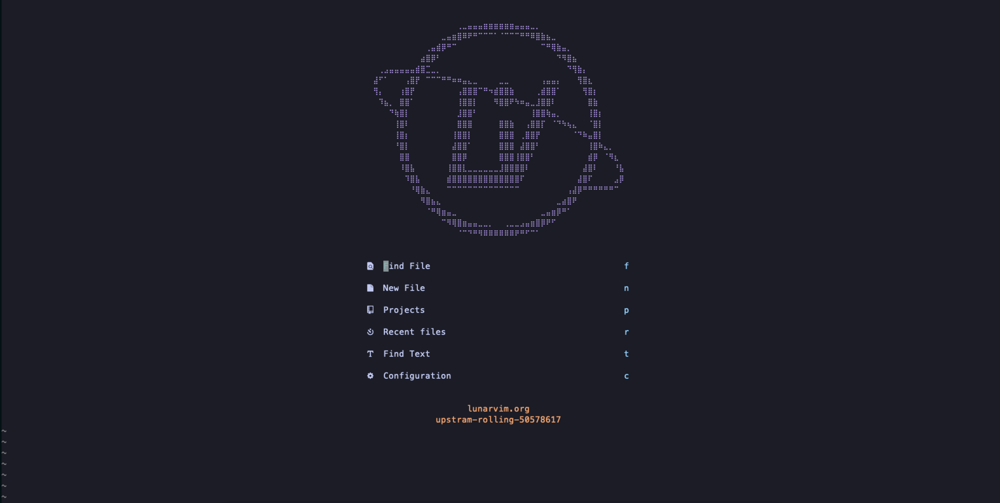
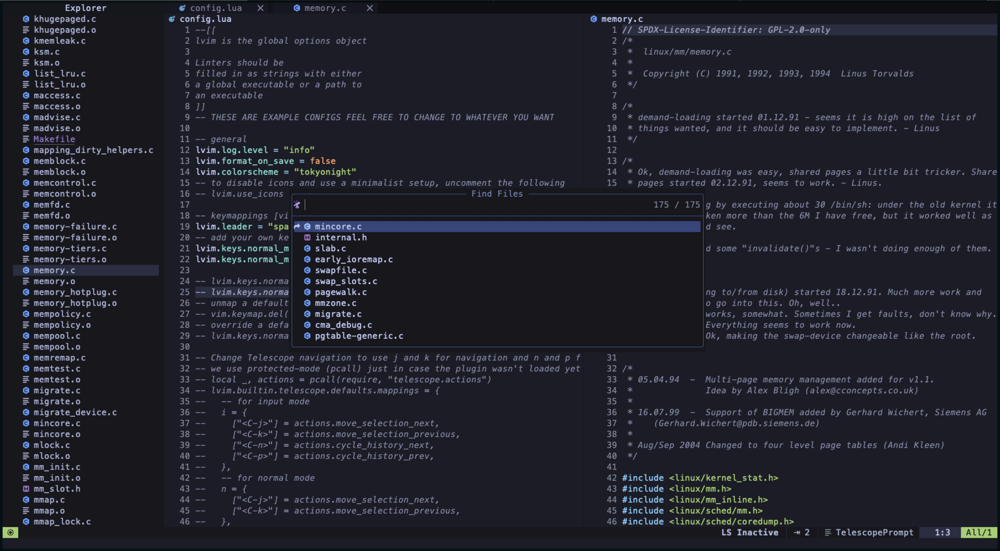

# CyborgLunarVim

---

> fork from lunarVim 

提供中文教程.便于使用lunarVim。LunarVim是一个由社区驱动的，打造的一个TUI的IDE框架.

---

## 部分页面展示

---

### 一、控制面板

### 二、界面展示

<!----------------------------------------------------------------------------->

## 样例配置文件

> 请看：sample_config.lua.template

## TODO

[] 对LunarVim的配置文件进行解释
[] 对LunarVim层级结构进行解释
  []  lua
  []  config/
  []  core/
  []  impatient/
  []  interface/
  []  lsp/
  []  utils/
  []  bootstrap.lua
  []  icons.lua
  []  impatient.lua
  []  keymappings.lua
  []  plugin-loader.lua
  []  plugins.lua
  []  utils.lua

